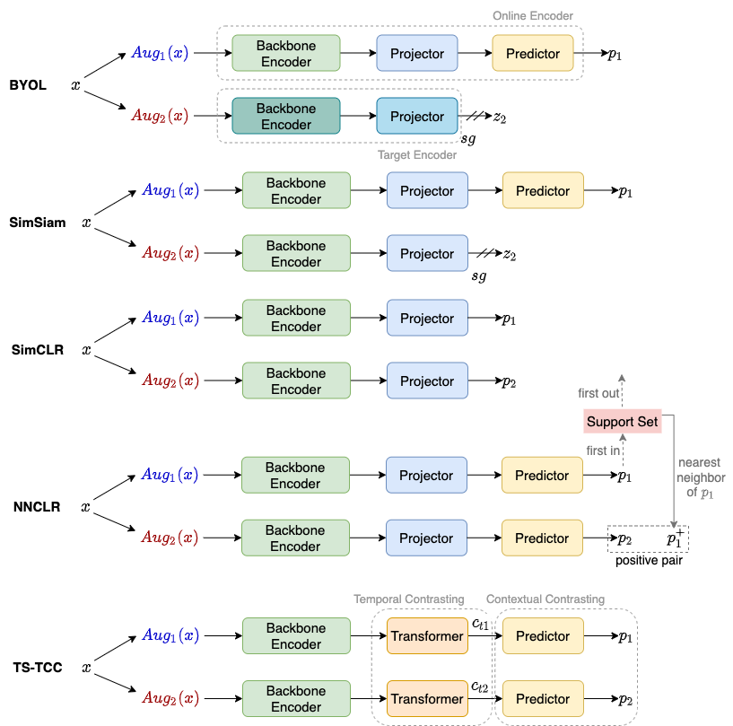
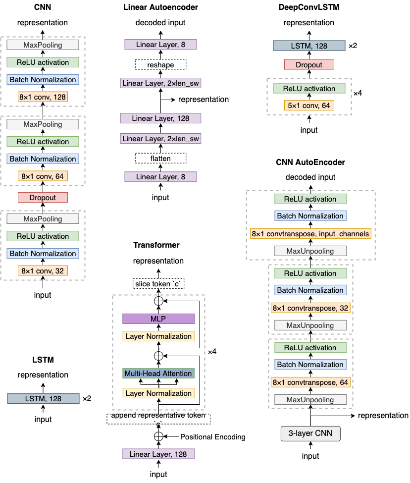
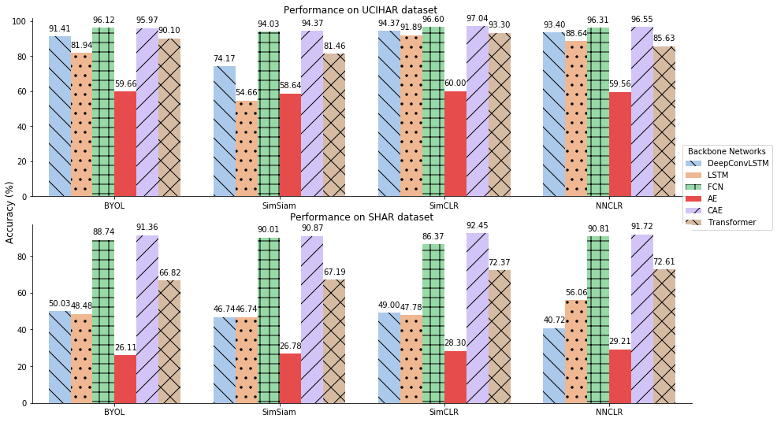

# CL-HAR

CL-HAR is an open-source PyTorch library of contrastive learning on wearable-sensor-based human activity recognition (HAR). For more information, please refer to our KDD-2022 paper ["What Makes Good Contrastive Learning on Small-Scale Wearable-based Tasks?"](https://arxiv.org/abs/2202.05998 ).

For more of our results, please refer to [results.md](results.md)

## Installation Requirements
To install required packages, run the following code. The current Pytorch version is 1.8.

```
conda create -n CL-HAR python=3.8.3
conda activate CL-HAR
pip install -r requirements.txt
```

For the version of torch and torchvision, we found torch==1.8.0 and torchvision==0.9.0 work fine on cuda 11.6 (Tesla V100). The version of these packages should be subject to the cuda version on your device


## Quick Start
To train contrastive models on UCIHAR dataset, run the following script.
```
python main.py --framework 'byol'    --backbone 'DCL' --dataset 'ucihar' --aug1 't_warp' --aug2 'negate' --n_epoch 60  --batch_size 128 --lr 5e-4 --lr_cls 0.3
python main.py --framework 'simsiam' --backbone 'DCL' --dataset 'ucihar' --aug1 't_warp' --aug2 'negate' --n_epoch 60  --batch_size 128 --lr 5e-4 --lr_cls 0.3
python main.py --framework 'simclr'  --backbone 'DCL' --dataset 'ucihar' --aug1 't_warp' --aug2 'negate' --n_epoch 120 --batch_size 256 --lr 3e-3 --lr_cls 0.03
python main.py --framework 'nnclr'   --backbone 'DCL' --dataset 'ucihar' --aug1 't_warp' --aug2 'negate' --n_epoch 120 --batch_size 256 --lr 3e-3 --lr_cls 0.02 --mmb_size 1024 
python main.py --framework 'tstcc'   --backbone 'FCN' --dataset 'ucihar' --aug1 't_warp' --aug2 'negate' --n_epoch 40  --batch_size 128 --lr 3e-4 --lr_cls 3e-4
```


## Supported Datasets
- UCIHAR [link](https://archive.ics.uci.edu/ml/datasets/human+activity+recognition+using+smartphones)
- SHAR [link](http://www.sal.disco.unimib.it/technologies/unimib-shar/)
- HHAR [link](http://archive.ics.uci.edu/ml/datasets/heterogeneity+activity+recognition)

## Data Split Cases
- random 
- subject
- subject_large


## Encoder Networks
Refer to ```models/backbones.py```
- FCN
- DeepConvLSTM
- LSTM
- AE
- CAE
- Transformer

To obtain supervised learning baselines of the encoder networks, you may use ```main_supervised_baseline.py```
<br>To train an encoder network under supervised setting, you can run the following code:
```angular2html
python main_supervised_baseline.py --batch_size 64 --lr 1e-4 --dataset 'ucihar' --backbone 'FCN' 
python main_supervised_baseline.py --batch_size 64 --lr 1e-4 --dataset 'ucihar' --backbone 'DCL' 
python main_supervised_baseline.py --batch_size 64 --lr 1e-4 --dataset 'ucihar' --backbone 'LSTM' 
python main_supervised_baseline.py --batch_size 64 --lr 1e-4 --dataset 'ucihar' --backbone 'Transformer' 
python main_supervised_baseline.py --lambda1 5.0 --batch_size 64 --lr 1e-4 --dataset 'ucihar' --backbone 'AE'
python main_supervised_baseline.py --lambda1 5.0 --batch_size 64 --lr 1e-4 --dataset 'ucihar' --backbone 'CNN_AE'
```
## Contrastive Models
Refer to ```models/frameworks.py```. For sub-modules (projectors, predictors) in the frameworks, refer to ```models/backbones.py```
- TS-TCC 
- SimSiam
- BYOL
- SimCLR
- NNCLR

## Architectures of Contrastive Models


## Architectures of Backbone Networks


## Visualization of performance on four contrastive models with six different backbone networks


## Loss Functions
- NTXent ```models/loss.py```
- Cosine Similarity

## Augmentations
Refer to ```augmentations.py```
- ### Time Domain
  - noise
  - scale
  - negate
  - perm
  - shuffle
  - t\_flip
  - t\_warp
  - resample
  - rotation
  - perm\_jit
  - jit\_scal

- ### Frequency Domain
  - hfc
  - lfc
  - p\_shift
  - ap\_p
  - ap\_f

## Utils
- logger
- t-SNE
- MDS


## Reference
If you find any of the codes helpful, kindly cite our paper.

> ```
>@misc{qian2022makes,
>      title={What Makes Good Contrastive Learning on Small-Scale Wearable-based Tasks?},
>      author={Hangwei Qian and Tian Tian and Chunyan Miao},
>      year={2022},
>      eprint={2202.05998},
>      archivePrefix={arXiv},
>      primaryClass={cs.LG}
>}
> ```


## Related Links
Part of the augmentation transformation functions are adapted from
- https://github.com/emadeldeen24/TS-TCC
- https://github.com/terryum/Data-Augmentation-For-Wearable-Sensor-Data
- https://github.com/LijieFan/AdvCL/blob/main/fr_util.py

Part of the contrastive models are adapted from 
- https://github.com/lucidrains/byol-pytorch
- https://github.com/lightly-ai/lightly
- https://github.com/emadeldeen24/TS-TCC

Loggers used in the repo are adapted from 
- https://github.com/emadeldeen24/TS-TCC
- https://github.com/fastnlp/fitlog
