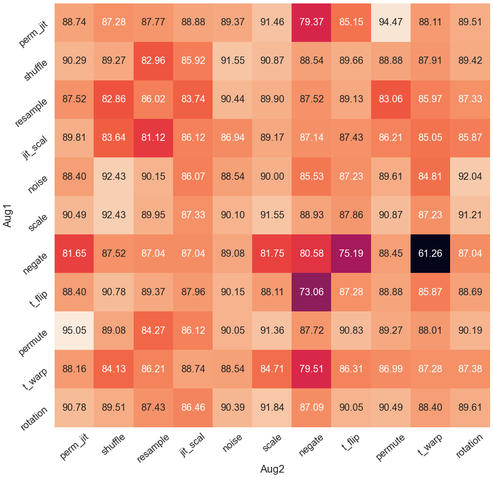
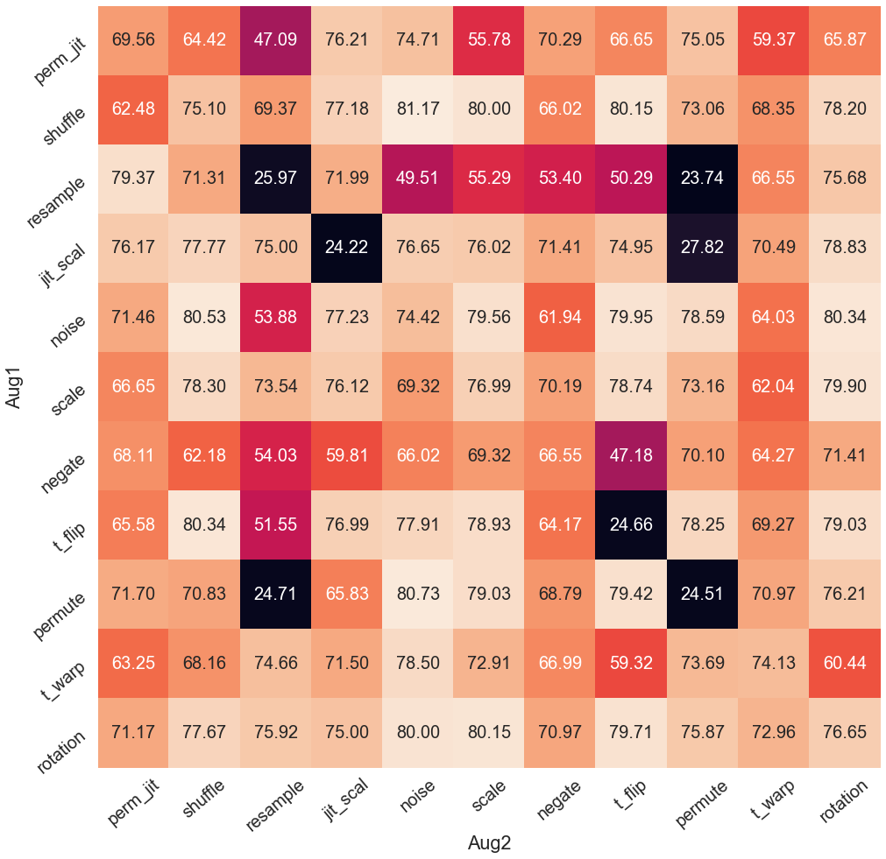
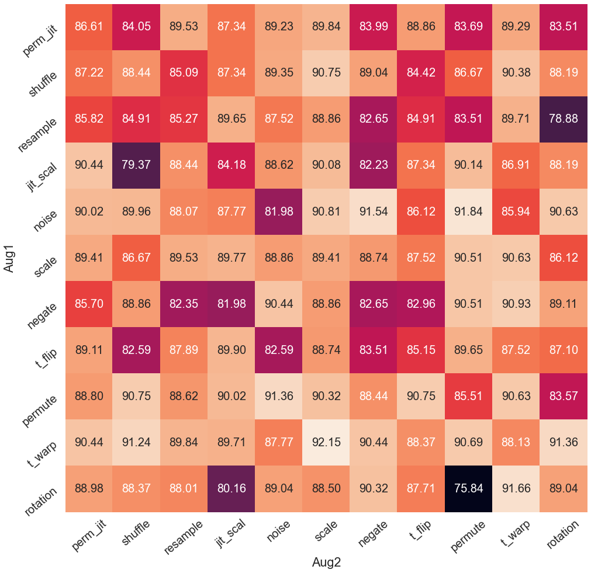
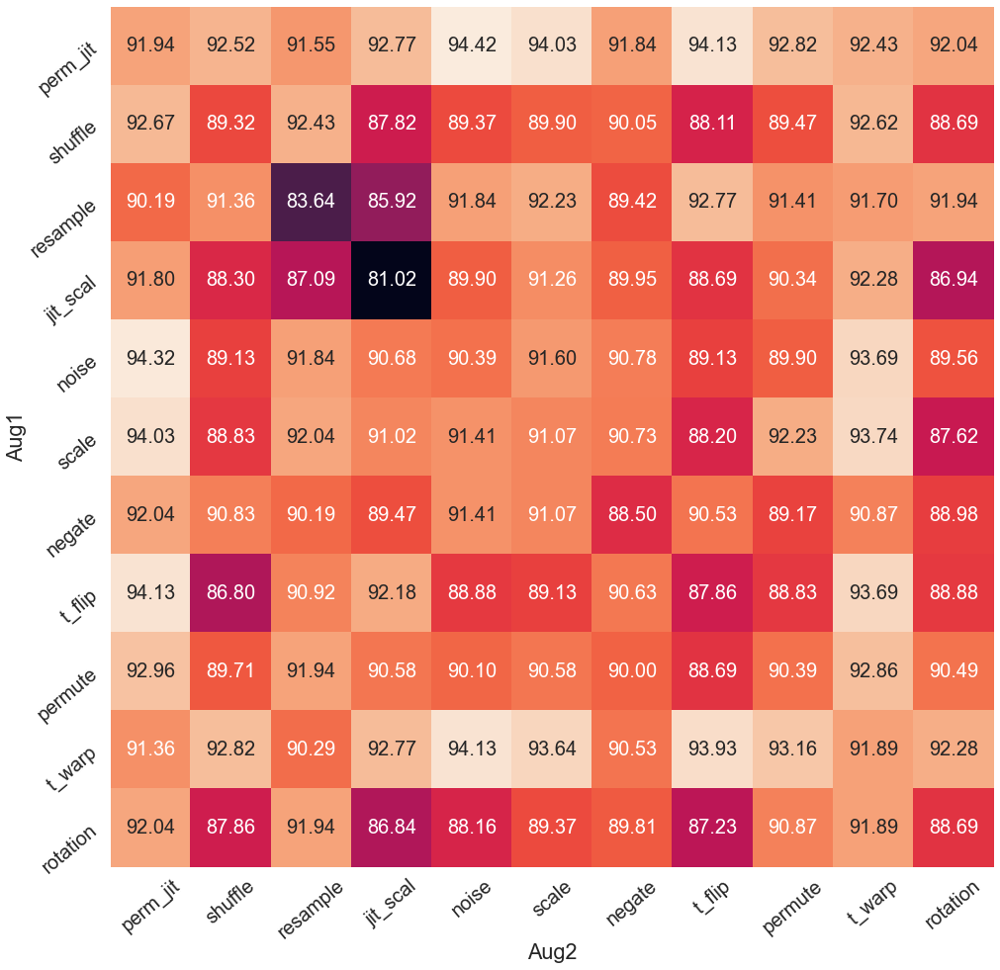

## Visualization of Time-Domain Augmentations (UCIHAR dataset)

## Visualization of Frequency-Domain Augmentations (SHAR dataset)

## Augmentation Results on BYOL 
UCIHAR             |  SHAR 
:-------------------------:|:-------------------------:
  |  

## Augmentation Results on SimSiam 
UCIHAR             |  SHAR 
:-------------------------:|:-------------------------:
  |  

## Augmentation Results on SimCLR
UCIHAR             |  SHAR 
:-------------------------:|:-------------------------:
  |  

## Augmentation Results on NNCLR
UCIHAR             |  SHAR 
:-------------------------:|:-------------------------:
  |  

## Augmentation Results on TS-TCC
UCIHAR             |  SHAR 
:-------------------------:|:-------------------------:
  |  

The settings listed in the table below achieve reasonable performance. However, the actual hyper-parameter setup should be subject to the changes of backbone networks and augmentations.

| Dataset  | Model   | Learning rate | Batch Size | Weight Decay | Temperature | EMA_decay  | Memory Bank Size | Epoch |
|----------|---------|---------------|------------|--------------|-------------|------------|------------------|-------|
| UCIHAR   | BYOL    | 5e-4          | 128        | 1.5e-6       | -           | 0.996      | -                | 60    |
|          | SimSiam | 5e-4          | 128        | 1e-4         | -           | -          | -                | 60    |
|          | SimCLR  | 3e-3          | 256        | 1e-6         | 0.1         | -          | -                | 120   |
|          | NNCLR   | 3e-3          | 256        | 1e-6         | 0.1         | -          | 1024             | 120   |
|          | TS-TCC  | 3e-4          | 128        | 3e-4         | 0.2         | -          | -                | 40    |
| SHAR     | BYOL    | 1e-3          | 64         | 1.5e-6       | -           | 0.996      | -                | 60    |
|          | SimSiam | 3e-4          | 256        | 1e-4         | -           | -          | -                | 60    |
|          | SimCLR  | 2.5e-3        | 256        | 1e-6         | 0.1         | -          | -                | 120   |
|          | NNCLR   | 2e-3          | 256        | 1e-6         | 0.1         | -          | 1024             | 120   |
|          | TS-TCC  | 3e-4          | 128        | 3e-4         | 0.2         | -          | -                | 40    |
