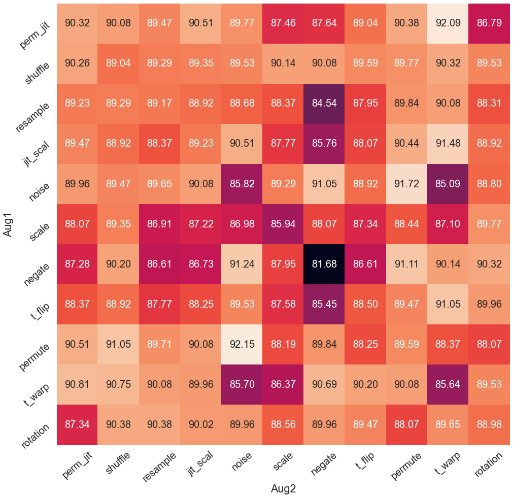
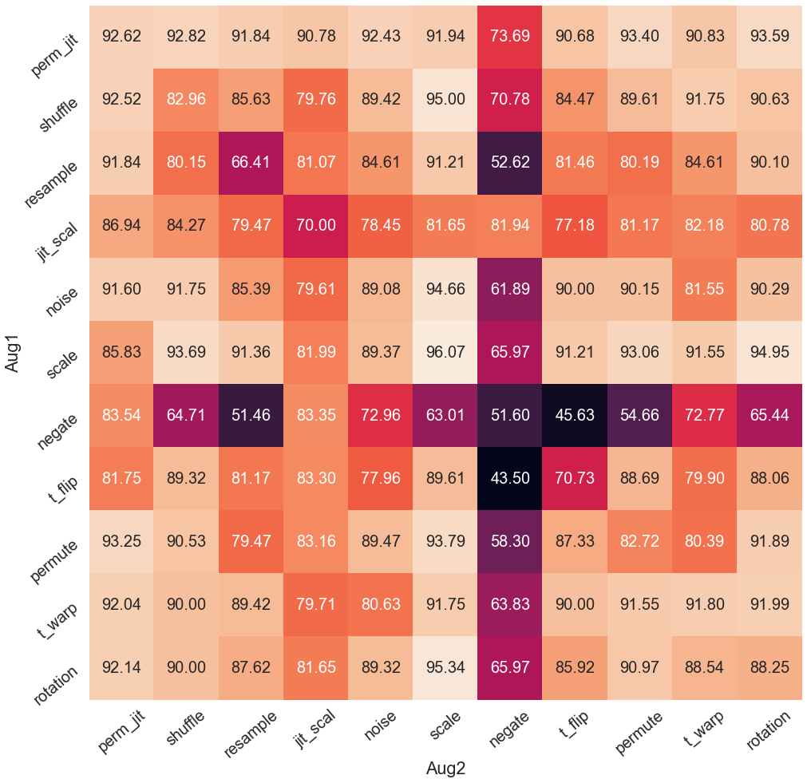
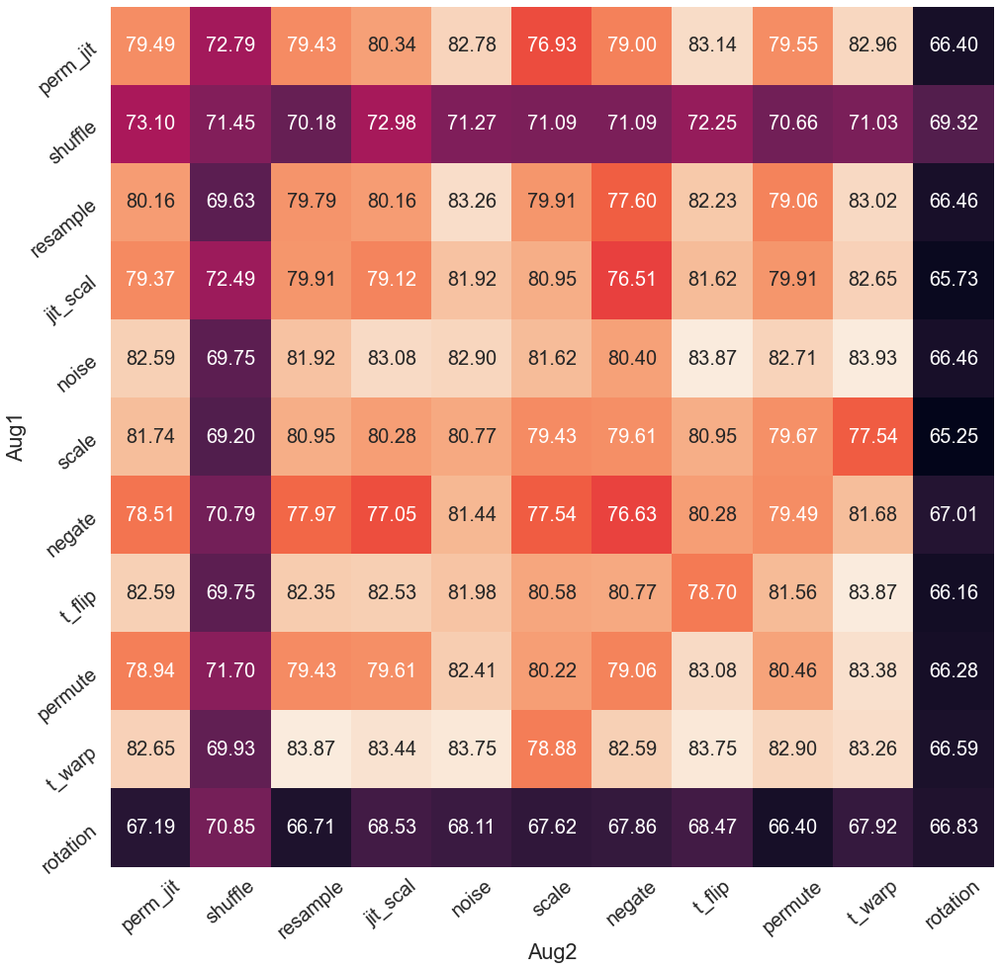

## Visualization of Time-Domain Augmentations

## Augmentation Results on BYOL 
UCIHAR             |  SHAR 
:-------------------------:|:-------------------------:
  |  

## Augmentation Results on SimSiam 
UCIHAR             |  SHAR 
:-------------------------:|:-------------------------:
  |  

# Augmentation Results on SimCLR
UCIHAR             |  SHAR 
:-------------------------:|:-------------------------:
  |  

# Augmentation Results on NNCLR
UCIHAR             |  SHAR 
:-------------------------:|:-------------------------:
  |  

# Augmentation Results on TS-TCC
UCIHAR             |  SHAR 
:-------------------------:|:-------------------------:
  |  
